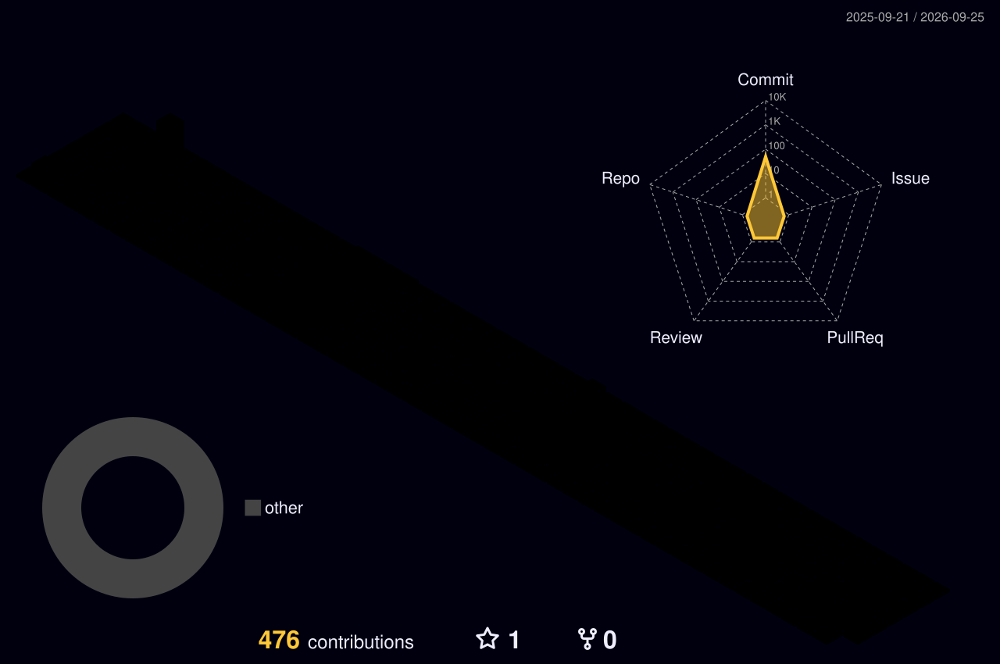

  <h1>👋 Hi, I'm Andrea Piscitelli</h1>
  
<strong>R&D Software Engineer &nbsp;|&nbsp; 3D Computer Vision &nbsp;|&nbsp; Autonomous Systems & Robotics</strong>

  

    📍 <em>Naples, Italy</em> &nbsp;•&nbsp; 
    🏢 <em>R&D at 3F & Edin</em> &nbsp;•&nbsp; 
    📫 <a href="mailto:andrea.piscitelli.1997@gmail.com">andrea.piscitelli.1997@gmail.com</a>
  

  

    
    
  

  

    
  

---

### 🚀 **About Me & Engineering Focus**

I am an R&D Software Engineer specialized in **Point Cloud Processing**, **LiDAR Integration**, and **Robotics**. My work bridges the gap between hardware sensory acquisition and robust 3D reconstruction, computer vision, and autonomous inspection pipelines.

- 🔭 **Current Focus**: Designing automated 3D reconstruction pipelines and autonomous inspection workstations at **3F & Edin**.
- 🔬 **Research & Deep Learning**: Experimenting with **GeoTransformer** for point cloud registration, **PointNet++** for outdoor semantic segmentation, and neural representation models (**NeRF** / 3D Gaussian Splatting).
- 📐 **Geometric Vision & Robotics**: Developing multi-scale coarse-to-fine registration algorithms (FPFH + RANSAC + Point-to-Plane ICP) and integrating ROS/ROS2 with visual/LiDAR SLAM.

---

  

### 🔬 **Featured Technical Projects & R&D**

#### 🏭 [**Pipe Detector & 3D Geometry Fitting Engine**](https://github.com/ndree97)
*Interactive desktop application for dense industrial point cloud inspection, pipe segmentation, and CAD geometry extraction.*
- **Tech Stack:** Python 3.12, Open3D, VTK, PyVistaQt, PyQt5, SciPy, NumPy.
- **Capabilities:** Fast KDTree spatial queries, automated RANSAC cylinder estimation, connectivity graph analysis, and multi-format export (`.pipeproject`, STL, VTK).

#### ☁️ [**PC Navigator — High-Throughput Point Cloud Workstation**](https://github.com/ndree97)
*Multi-threaded processing workstation for massive geospatial and industrial LiDAR data (LAS / LAZ).*
- **Tech Stack:** Python, PyQt5, NumPy, Open3D, Multiprocessing Workers.
- **Capabilities:** Real-time scalar field computation, statistical & radius outlier removal (SOR/ROR), vertical plane segmentation, and custom camera navigation filters.

#### 🔄 [**Robust Coarse-to-Fine Point Cloud Registration Pipeline**](https://github.com/ndree97)
*Production-ready pipeline for rigid alignment of multi-source and multi-scale point clouds.*
- **Tech Stack:** Open3D, Python, C++, NumPy.
- **Methodology:** Multi-scale voxel downsampling ➔ Hybrid normal estimation ➔ FPFH feature extraction ➔ RANSAC mutual-correspondence global alignment ➔ Point-to-Plane ICP refinement (inlier RMSE < 1e-3).

---

### 🛠️ **Tech Stack & Tooling**

  

  
🔍 <strong>Categorical Breakdown (65 Technologies)</strong>

  - **Languages & Scripting:** Python, C++, C#, Swift, MATLAB, JavaScript, HTML5, CSS3, Bash, PowerShell, GTK, LaTeX, Markdown.
  - **AI, 3D Vision, Robotics & Graphics:** PyTorch, TensorFlow, OpenCV, Anaconda, Three.js, ROS, CMake, Arduino, Raspberry Pi, Unity, SketchUp, Figma, Photoshop.
  - **Web, Mobile & Backend Frameworks:** React, Vue, Flutter, Tailwind CSS, Bootstrap, FastAPI, Flask, Node.js, Express, NestJS, GraphQL, npm, Postman.
  - **Cloud, DevOps, Database & Infrastructure:** Docker, Kubernetes, OpenStack, Git, GitHub, GitLab, Google Cloud, Cloudflare, Vercel, Supabase, Firebase, MongoDB, MySQL.
  - **Data Stores, IDEs, Productivity & OS:** Redis, Apache Kafka, VS Code, Visual Studio, Eclipse, Obsidian, Notion, Ableton, Linux, macOS/Apple, Windows, Discord, Stack Overflow.

---

### ⚡ **Recent Open Source Activity**

<!-- START_SECTION:projects -->

- 🐍 [**Extraction-of-Top-5-Football-Stats-2023-2024**](https://github.com/ndree97/Extraction-of-Top-5-Football-Stats-2023-2024) - *Python*  
  A project for analyzing football player statistics from the top 5 leagues during the 2023-2024 season. The script reads data from a CSV file, processes it, and outputs an Excel file with separate sheets for each competition, providing insights on player performance. (⭐ 1)

- 🐍 [**UP_DROP**](https://github.com/ndree97/UP_DROP) - *Python*  
  No description provided. (⭐ 0)

- 🐍 [**alwaysON**](https://github.com/ndree97/alwaysON) - *Python*  
  No description provided. (⭐ 0)

- 🐍 [**CSV-to-JSON-Converter**](https://github.com/ndree97/CSV-to-JSON-Converter) - *Python*  
  This project contains a simple Python script designed to convert a CSV file into a JSON file. The script reads data from a specified CSV file, converts each row into a dictionary, and exports the result into a JSON file. It includes functionality to check if the input file exists and provides clear output in case of errors. (⭐ 0)

<!-- END_SECTION:projects -->

---

### 📊 **GitHub Activity & Statistics**

  
  <!--  -->

  

<!-- ---

### ⭐ **Star History**

  <a href="https://star-history.com/#ndree97/ndree97&ndree97/Extraction-of-Top-5-Football-Stats-2023-2024&Date">
    <picture>
      <source media="(prefers-color-scheme: dark)" srcset="https://api.star-history.com/svg?repos=ndree97/ndree97,ndree97/Extraction-of-Top-5-Football-Stats-2023-2024&type=Date&theme=dark" />
      <source media="(prefers-color-scheme: light)" srcset="https://api.star-history.com/svg?repos=ndree97/ndree97,ndree97/Extraction-of-Top-5-Football-Stats-2023-2024&type=Date" />
      
    </picture>
  </a>

 -->

---

  Designed & engineered with precision by <a href="https://github.com/ndree97">Andrea Piscitelli</a>

