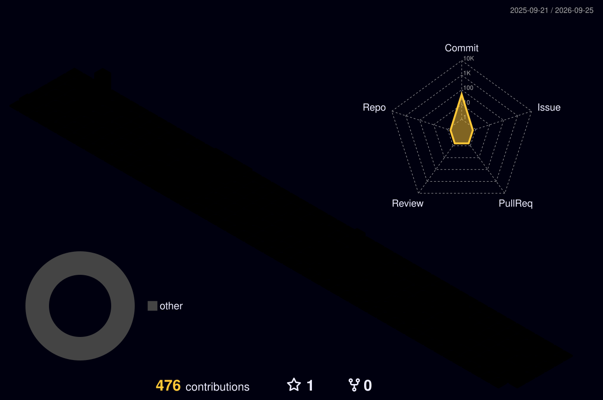

<div align="center">
  <h1>👋 Hi, I'm Andrea Piscitelli</h1>
  

  <p align="center">
    <a href="https://github.com/ndree97">
      
    </a>
  </p>
</div>

---

### 🚀 **About Me & Engineering Focus**

I am an R&D Software Engineer specialized in **Point Cloud Processing**, **LiDAR Integration**, and **Robotics**. My work bridges the gap between hardware sensory acquisition and robust 3D reconstruction, computer vision, and autonomous inspection pipelines.

- 🔭 **Current Focus**: Designing automated 3D reconstruction pipelines and autonomous inspection workstations at **3F & Edin**.
- 🔬 **Research & Deep Learning**: Experimenting with **GeoTransformer** for point cloud registration, **PointNet++** for outdoor semantic segmentation, and neural representation models (**NeRF** / 3D Gaussian Splatting).
- 📐 **Geometric Vision & Robotics**: Developing multi-scale coarse-to-fine registration algorithms (FPFH + RANSAC + Point-to-Plane ICP) and integrating ROS/ROS2 with visual/LiDAR SLAM.

---
<div align="center">
  
</div>

---

### 🛠️ **Tech Stack & Tooling**

<p align="left">
  <a href="https://skillicons.dev">
    
  </a>
</p>

<details>
  <summary>🔍 <strong>Categorical Breakdown (65 Technologies)</strong></summary>

  - **Languages & Scripting:** Python, C++, C#, Swift, MATLAB, JavaScript, HTML5, CSS3, Bash, PowerShell, GTK, LaTeX, Markdown.
  - **AI, 3D Vision, Robotics & Graphics:** PyTorch, TensorFlow, OpenCV, Anaconda, Three.js, ROS, CMake, Arduino, Raspberry Pi, Unity, SketchUp, Figma, Photoshop.
  - **Web, Mobile & Backend Frameworks:** React, Vue, Flutter, Tailwind CSS, Bootstrap, FastAPI, Flask, Node.js, Express, NestJS, GraphQL, npm, Postman.
  - **Cloud, DevOps, Database & Infrastructure:** Docker, Kubernetes, OpenStack, Git, GitHub, GitLab, Google Cloud, Cloudflare, Vercel, Supabase, Firebase, MongoDB, MySQL.
  - **Data Stores, IDEs, Productivity & OS:** Redis, Apache Kafka, VS Code, Visual Studio, Eclipse, Obsidian, Notion, Ableton, Linux, macOS/Apple, Windows, Discord, Stack Overflow.
</details>

---

### ✨📊 **Welcome to my GitHub Profile!**

<div align="center">

<!--START_SECTION_PROFILE_VIEWS:readme-info-->
**✨ Welcome to my GitHub Profile!**
<!--END_SECTION_PROFILE_VIEWS:readme-info-->

<!--START_SECTION_LINES_OF_CODE:readme-info-->
**From Hello World I have written 1.5 million Lines of Code 🧑‍💻**
<!--END_SECTION_LINES_OF_CODE:readme-info-->

<!--START_SECTION_DAILY_COMMIT:readme-info-->
```text
I'm an early 🐤

🌞 Morning     68 commits ███████░░░░░░░░░░░░░░░░░░  26.8%
🌆 Daytime    159 commits ████████████████░░░░░░░░░  62.6%
🌃 Evening      0 commits ░░░░░░░░░░░░░░░░░░░░░░░░░   0.0%
🌙 Night       27 commits ███░░░░░░░░░░░░░░░░░░░░░░  10.6%
```
<!--END_SECTION_DAILY_COMMIT:readme-info-->

<!--START_SECTION_WEEKLY_COMMIT:readme-info-->
```text
📅 I'm Most Productive on Thursdays

Monday        53 commits █████░░░░░░░░░░░░░░░░░░░░  18.4%
Tuesday       44 commits ████░░░░░░░░░░░░░░░░░░░░░  15.3%
Wednesday     54 commits █████░░░░░░░░░░░░░░░░░░░░  18.8%
Thursday      62 commits █████░░░░░░░░░░░░░░░░░░░░  21.5%
Friday        59 commits █████░░░░░░░░░░░░░░░░░░░░  20.5%
Saturday      12 commits █░░░░░░░░░░░░░░░░░░░░░░░░   4.2%
Sunday         4 commits ░░░░░░░░░░░░░░░░░░░░░░░░░   1.4%
```
<!--END_SECTION_WEEKLY_COMMIT:readme-info-->

<!--START_SECTION_LANGUAGE:readme-info-->
```text
My 💖 language Python

Python       38 repos ███████████████████████░░  92.7%
HTML          2 repos █░░░░░░░░░░░░░░░░░░░░░░░░   4.9%
JavaScript    1 repos █░░░░░░░░░░░░░░░░░░░░░░░░   2.4%
```
<!--END_SECTION_LANGUAGE:readme-info-->

<!--START_SECTION_CONTRIBUTIONS:readme-info-->
**🏆 483 Contributions in year 2026**
<!--END_SECTION_CONTRIBUTIONS:readme-info-->

</div>

---

<div align="center">
  <sub>Designed & engineered by <a href="https://github.com/ndree97">Andrea Piscitelli</a></sub>
  <br /><br />
  <p align="center">
    <a href="https://www.linkedin.com/in/andrea-piscitelli-34379b153/" target="_blank">
      
    </a>
    <a href="https://x.com/AndrixMcCormick" target="_blank">
      
    </a>
    <a href="mailto:andrea.piscitelli.1997@gmail.com">
      
    </a>
  </p>
</div>
